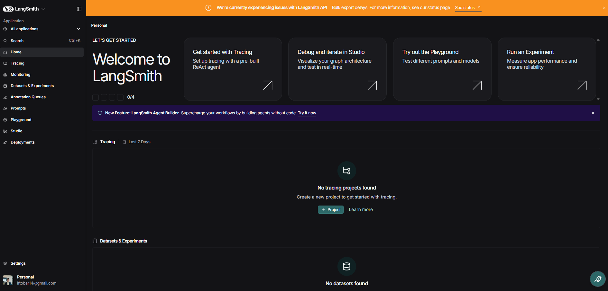
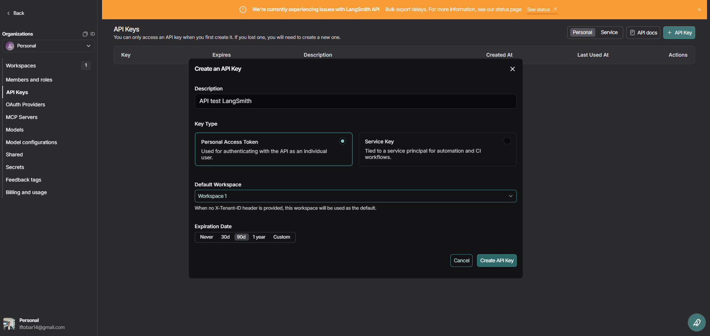
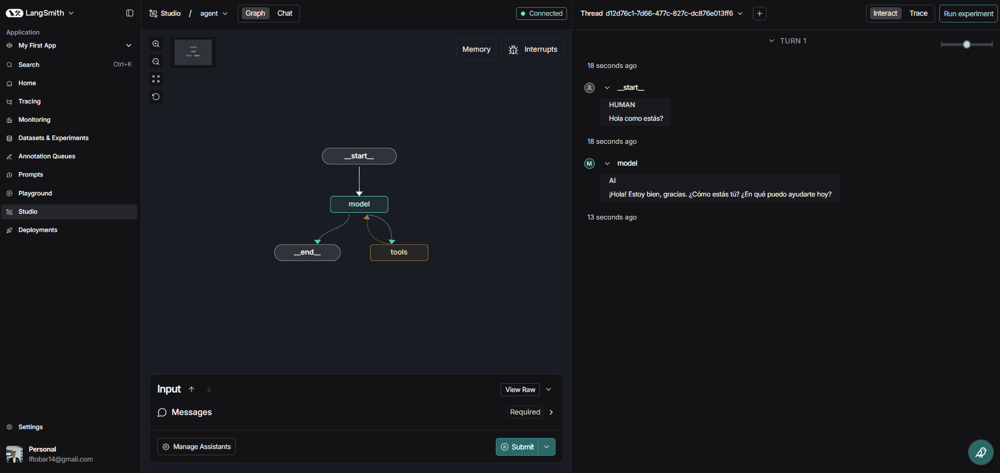

# LangGraph_practicas
Repositorio de prácticas y ejemplos sobre LangGraph, (RAG, agentes, multi-agentes, ReAct Agents, paralelización, orquestación e integraciones con FastAPI-endpoints REST)

Documentación oficial de [LangGraph](https://docs.langchain.com/oss/python/langgraph/overview)

## Clase 2: Instalación y configuración de LangGraph
Configuración:
```
uv init
uv venv
".venv/Scripts/activate"
uv pip install torch torchvision --index-url https://download.pytorch.org/whl/cu121
uv add ipykernel --dev
uv add langchain langgraph langchain-community langchain-google-genai langchain-ollama langchain-experimental langchain-openai python-dotenv
```

También se necesatia el debugger propio de LangGraph, que puede ser instalado con ("--dev" indica que es una dependencia de desarrollo, no necesaria para producción):
```
uv add langgraph-cli --dev
uv add "langgraph-cli[inmem]" --dev
```

Lo que se haya instalado con uv add se reflejará en el archivo pyproject.toml, y lo que se haya instalado con uv pip install no. ```uv pip install -e```

Se debe crear un archivo de configuración *"langgraph.json"*.

**PARA FEBRERO DE 2026 AHORA LA VISUALIZACIÓN YA NO ES OPENSOURCE - ES CON LANGSMITH Y CUESTA**

1. *Crear cuenta en langsmith:*

2. *Crear API de LangSmith*:

3. Colocar la API Key en el archivo .env:
```LANGSMITH_API_KEY=sk-xxxxxx```

Ejecutar ```langgraph dev``` o con ```uv run langgraph dev```

